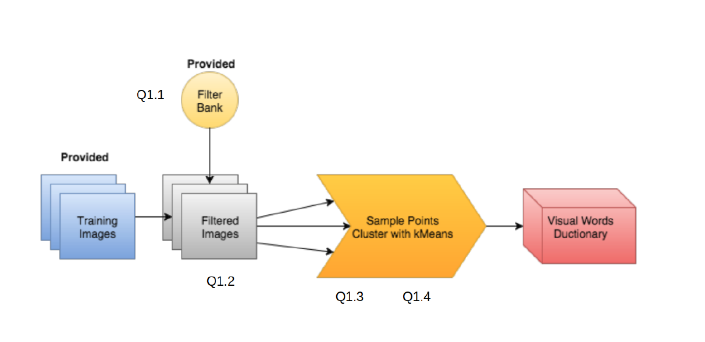
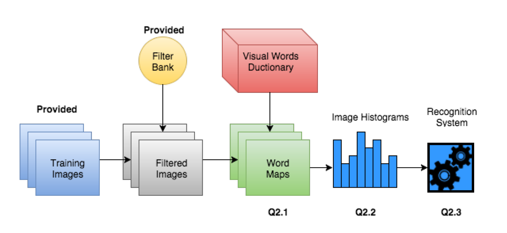
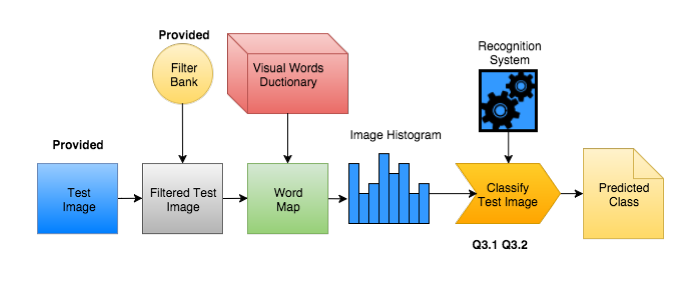

# Computer-Vision__Scene-classification-system-using-bag-of-words
Developed a system for scene classification. Trained on a subset of the SUN Image database consisting of eight scene categories, built an end to end system that can determine which type of scene it is when given a new scene picture.

# How to implement 
This project has 3 major parts. \
*Part 1: build a dictionary of visual words from training data. \
*Part 2: build the recognition system using visual word dictionary and training images. \
*Part 3: evaluate the recognition system using test images. \
 \
# Part 1
In Part 1, we use the provided filter bank to convert each pixel of each image into
a high dimensional representation that will hopefully capture meaningful information, such
as corners, edges etc. This will take each pixel from being a 3D vector of color values, to
an nD vector of filter responses. We'll then take these nD pixels from all of the training
images and and run K-means clustering to n dimension groups of pixels. Each resulting cluster center
will become a visual word, and the whole set of cluster centers becomes our dictionary of
visual words. In theory, we would like to use all pixels from all training images, but this
is very computationally expensive. Instead, we will only take a small sample of pixels from
each image. One option is to simply select pixels from each one uniformly at random.
Another option is to use some feature detector (Harris Corners for example), and take alpha
feature points from each image. I did both to produce two dictionaries, so that we
can compare their relative performances. The procedure is as follow. 
 

# Part 2
The dictionary of visual word produced will be applied to each of the training images to convert them into a wordmap. This will take each of the nD pixels in all of the filtered training images and assign each one a single integer label, corresponding to the
closest cluster center in the visual words dictionary. Then each image will be converted to
a "bag of words"; a histogram of the visual words counts. You will then use these to build
the classifier (Nearest Neighbours, and SVM for extra credit). See as below
 

# Part 3
Evaluate the recognition system that you built. This will involve taking
the test images and converting them to image histograms using the visual words dictionary
and the function you wrote in Part 2. Next, for nearest neighbor classification, you will use a
histogram distance function to compare the new test image histogram to the training image
histograms in order to classify the new test image. Doing this for all the test images. The result turned out to be about 50% accuracy.
Also I tried to use SVN to claasify the eight scenes, which turned out to be about 55% accuracy. 
 

